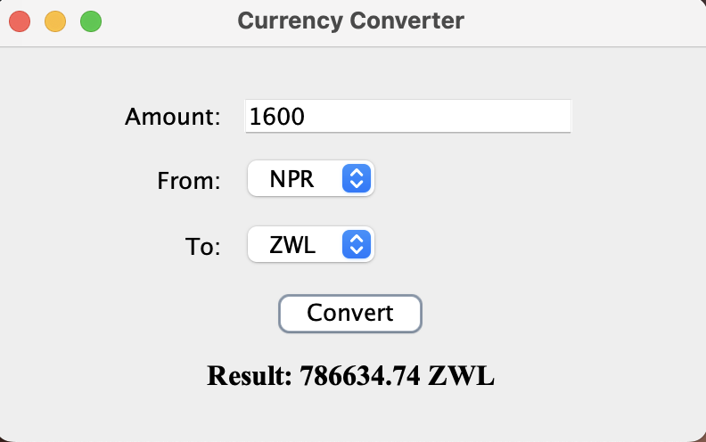
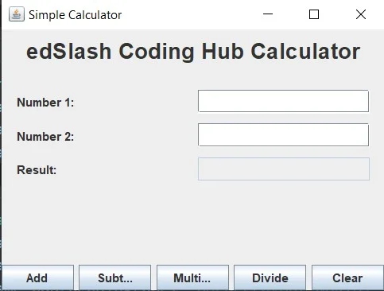

# Java Programming Practice Problems

Here's a set of practice problems for your students, categorized into Very Short Answer, Short Answer, and Long Questions, to help them prepare for their Object-Oriented Programming (Java) course.

## Very Short Answer Questions (30 Questions)

Attempt all questions. Give your answer in a few lines.

1.  Define class and objects.
2.  Explain any two features of Java.
3.  State any two differences among public, protected, and private access modifiers.
4.  What is the 'this' pointer in Java?
5.  Define an abstract class.
6.  Mention two differences between byte streams and character streams.
7.  List two advantages of Swing over AWT for building GUIs in Java.
8.  What is an exception in Java?
9.  What is a generic class?
10. List any two advantages and disadvantages of using Java.
11. What do JDK and JRE stand for?
12. What is an object in Java and how is it instantiated?
13. What is the purpose of access specifiers in Java?
14. Define static members.
15. What is an abstract method?
16. What is the primary purpose of the DataOutputStream class?
17. What role does JFrame play in a typical Swing application?
18. What is a generic method?
19. What is the purpose of the 'main' method in Java?
20. Briefly describe encapsulation in object-oriented programming.
21. Define polymorphism.
22. How does a compile-time error differ from a runtime error?
23. What is garbage collection in Java?
24. What is a constructor in Java?
25. Explain the concept of "platform independence" in Java.
26. What is the Java Virtual Machine (JVM)?
27. List two types of control statements in Java.
28. What is the purpose of an array in Java?
29. Define a package in Java.
30. What is an interface in Java?

## Short Answer Questions (18 Questions)

Attempt any five questions.

1.  Write a Java program to input 10 integers into an array and calculate their sum.
2.  Write a Java program to create a class 'Rectangle' with attributes for length and width, and methods to calculate area and perimeter.
3.  What are interfaces in Java, and how are they different from abstract classes? Explain with an example.
4.  Differentiate between method overriding and method overloading in Java. Also, provide a Java code demonstrating method overloading.
5.  What is exception handling in Java? Explain how 'ArrayIndexOutOfBoundsException' occurs and how to handle it.
6.  Distinguish between byte stream and character stream. Write a program to save data of 20 students (Student ID, Name, Address, Phone Number) in a file named 'Student.txt'.
7.  Write a Java program to calculate the factorial of a given number.
8.  Write a Java program to define a class 'Employee' with fields for name, employeeId, and salary. Include a constructor to initialize these fields, and a method to give a 10% salary raise. Display the updated salary.
9.  Explain how packages help in organizing code and avoiding naming conflicts in Java.
10. Explain the difference between static binding and dynamic binding. Write a Java program to demonstrate dynamic method dispatch.
11. What is exception handling in Java? Explain how 'ArithmeticException' is generated and handled.
12. Differentiate between 'FileInputStream' and 'FileOutputStream'. Write a Java program to store 20 products (Product_ID, Product Name, MFD, Quantity) in a file called 'product.dat'.
13. What is constructor overloading in Java? Explain with a suitable example.
14. Describe the benefits of using generics in Java. Provide an example of a generic method.
15. Explain how to use command-line arguments in Java with an example.
16. Describe the significance of the 'final' keyword in Java. Provide examples for variables, methods, and classes.
17. Write a Java program that demonstrates the use of the 'super' keyword in inheritance.
18. Explain the difference between the '==' operator and the 'equals()' method when comparing objects in Java. Provide a code example.

## Long Questions (8 Questions)

1.  Explain how to read and write primitive data types (like 'int', 'double', 'boolean', 'String') to a file using 'DataInputStream' and 'DataOutputStream'. Provide a complete Java code example demonstrating both writing and reading.

2.  Write a program to create the following GUI using Swing components: a currency converter. When the user clicks "Convert", the amount in NPR should be converted to INR and USD and displayed in their respective fields. Assume suitable conversion rates.

    

3.  Write a Java program to do the following:
    a. Create an interface 'Calculate' with methods:
        i.  'int sum(int, int)'
        ii. 'int diff(int, int)'
    b. Create a class 'PerformCalculation' that implements both methods.
    c. Write a class 'DemoCalculate' with a 'main' method to:
        i.  Take two integers as input from the user
        ii. Create an object of 'PerformCalculation' to calculate sum and difference
        iii. Display the results on the console

4.  Describe the hierarchy of Java I/O classes. Explain the purpose of the key abstract base classes ('InputStream', 'OutputStream', 'Reader', 'Writer') and how concrete classes extend them to provide specific functionalities.

5.  Write a Java program to build the following Swing-based UI: a basic calculator. When the user clicks the "Add" "Subtract" "Multiply" or "Divide" button, the two numbers from the text fields should be processed accordingly and the result should be displayed.

    

6.  Write a Java program with the following structure:
    a. Define an interface 'GeometricShape' with:
        i.  'double calculateArea()'
        ii. 'double calculatePerimeter()'
    b. Create a class 'Circle' that implements 'GeometricShape':
        i.  Include a private double variable for radius
        ii. Use a constructor to initialize radius
        iii. Implement both methods to calculate area and perimeter
    c. Create a 'DemoShape' class with 'main' method:
        i.  Accept the radius from the user using Scanner
        ii. Instantiate the 'Circle' class
        iii. Call the methods and display area and perimeter formatted to two decimal places

7.  Design and implement a Java program simulating a simple banking system. Include:
    - A class 'Account' with account number, balance, and methods for deposit and withdrawal
    - A class 'Customer' with customer ID, name, and a list of accounts
    - Demonstration of creating accounts, performing transactions, and displaying customer details

8.  Create a Java Swing application that:
    - Allows the user to type into a 'JTextArea'
    - Includes a button to save the content to a specified text file
    - Includes another button to load and display the content from a selected file into the 'JTextArea'
    - Handles file operation errors appropriately
